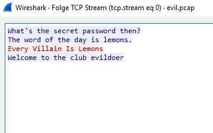
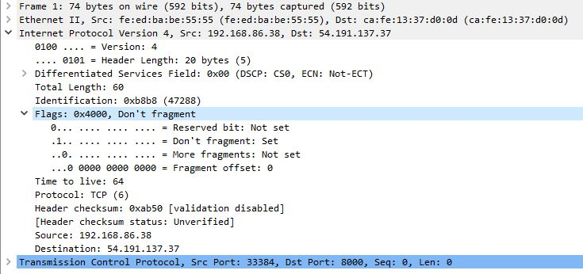
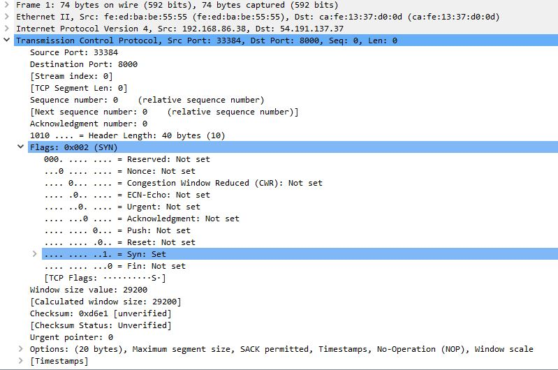

This is gonna be my first Write-up since my journey in InfoSec started. I want to lead you all a little bit throughout my process of thought and my approach on breaking this chall. Since I work in something like "Network Security" this was not the hardest chall for me but a good learning opportunity on using scapy for something. Which was on my personal pile-of-shame for quiet a long time. If you like this kind of write-up, pls let me know on Twitter or something - @DennisDeLarge . 

We were presented with a small but helpful introduction.

> I'm trying to break into the EVIL club and I've figured out their password. I still can't get in though because they now have a new secret evil handshake. I've attached what I captured from the old handshake, maybe it will help.
> 
> nc 35.155.188.29 8000
> 
> (Note: be careful trying this problem in a "non-standard" networking setup).

There are a few takeaway's here. We will come back later on but it clearly states the use of a "new secret evil handshake" and in particular the Note further down is pointing to your network setup. Cause I never heard of the following, this didn't pull the magic trigger in my brain. But still, a few good hint's on where to look for stuff.

As always, let's see what happens if we connect to the chall.
```txt
nc 35.155.188.29 8000
Clearly you're not evil enough.
```
Okay, there is no way to really interact with the chall on the first attempt. It just let's you know - you are not even trying to be evil. 
Obviously the chall needs to start with the first few packets sent out to the service. Sounds like packet manipulation huh? Kinda.

So - on to what else we have.
There is a .pcap supplied with the chall. Let's fire up a wireshark and see what we can extract from it.
The .pcap itself is stripped down to what we really need which makes it easy to read - no distractions here. The .pcap starts with the initial 3-Way-Handshake.

First things first. While following the TCP Stream we see the following message being transferred.


As we know there is more to this, than just a secret passphrase, transferred in cleartext. We keep this in mind for our exploit and keep on searching for the final bit of this story.

My next attempt was to look a bit closer to the initial 3-Way-Handshake (the first three packets here..)
A closer look in our wireshark reveals nothin really interesting. Let's have a look at the IP- and TCP-Header of the first packet.



Nothing Special here - but keep in mind, that's not the trace of a working connection. It's just a trace of the secret that's exchanged, and as we can see the secret is exchanged AFTER the initial 3-Way-Handshake

Now, my next attempt was using scapy. For the initial information gathering I wrote very simple script to parse out the data of the first three packets from the pcap to screen for analysis.

What this does is basicly parse the whole pcap and show the first three packets...We really need just the first.
There are way better and cooler ways in scapy to do this, but nothing fancy needed here. In short - you can write lambda functions to manipulate the packets WHILE parsing into the scapy array structure. That gives you kinda endless possibilitys to manipulate the sniffed traffic. As you can see I'm using the scapy own "sniff" function. This can also take a live ethernet stream from an interface. Combined with the previous part with the lambda function this is really powerful. 

Scapy builds object like structures for every packet which are devided by layers which makes this easy to follow while writing and working with those packets.

```python
#!/usr/bin/python
from scapy.all import *

# lets start by sniffing the first 3 packets from the pcap and print it's metadate as best as possible
packets = sniff(offline='evil.pcap')

packets[0].show()
packets[1].show()
packets[2].show()

```
This gives us the following output.
```txt
INSERT SCAPY OUTPUT HERE
```


This is my really dirty and debuggery script to solve this chall.
```python
#!/usr/bin/python
from scapy.all import *


# Setup some variables
src = "10.18.41.50"
dst = "35.155.188.29"
sport = random.randint(1024,65535)
dport = int("8000")

# lets start by sniffing the first 3 packets from the pcap and print it's metadate as best as possible

# packets = sniff(offline='evil.pcap')

#packets[0].show()
#packets[1].show()
#packets[2].show()

# build the initial 3-way-handshake
# SYN
ip=IP(src=src,dst=dst,flags=4,frag=0)
SYN=TCP(sport=sport,dport=dport,flags='S',seq=1000)
SYNACK=sr1(ip/SYN)
#SYNACK.show()
# ACK
ACK=TCP(sport=sport, dport=dport, flags='A', seq=SYNACK.ack, ack=SYNACK.seq + 1)
INITACK=sr1(ip/ACK)


# examine the secret handshake of the evilclub
# PUSHACK.show()
# Ref: The word of the day is VARIABLE.
secretlines = INITACK.load.splitlines()
secret = str(secretlines[2].split()[6:])[2:-3].title()
print secretlines[2]
print secret

# build correct response
# Ref: Every Villain Is VARIABLE
data = 'Every Villain Is '
data += secret
data += '\n'
print data
PUSHACK=TCP(sport=sport, dport=dport, flags='PA', seq=INITACK.ack, ack=INITACK.seq + 1)
RESPONSE=sr1(ip/PUSHACK/Raw(load=data))
RESPONSE.show()

# hopefully get the flag
```
